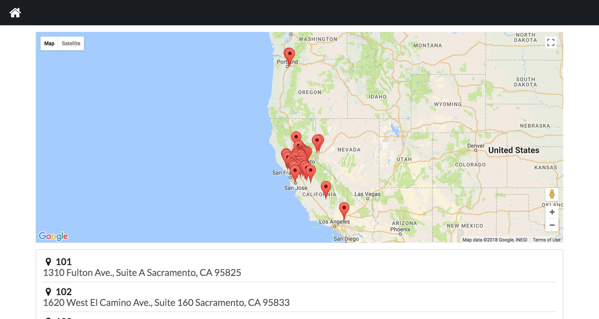
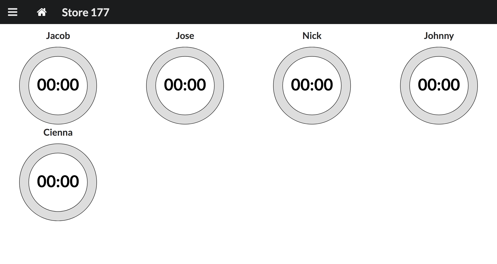
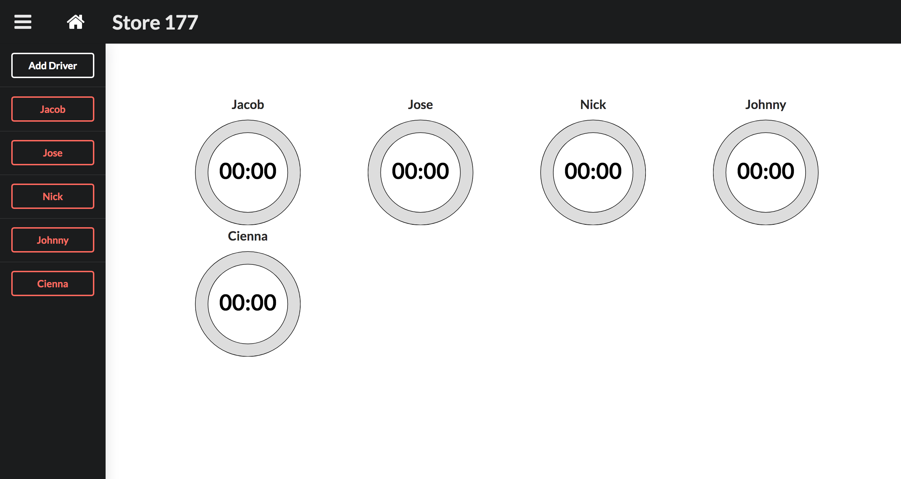
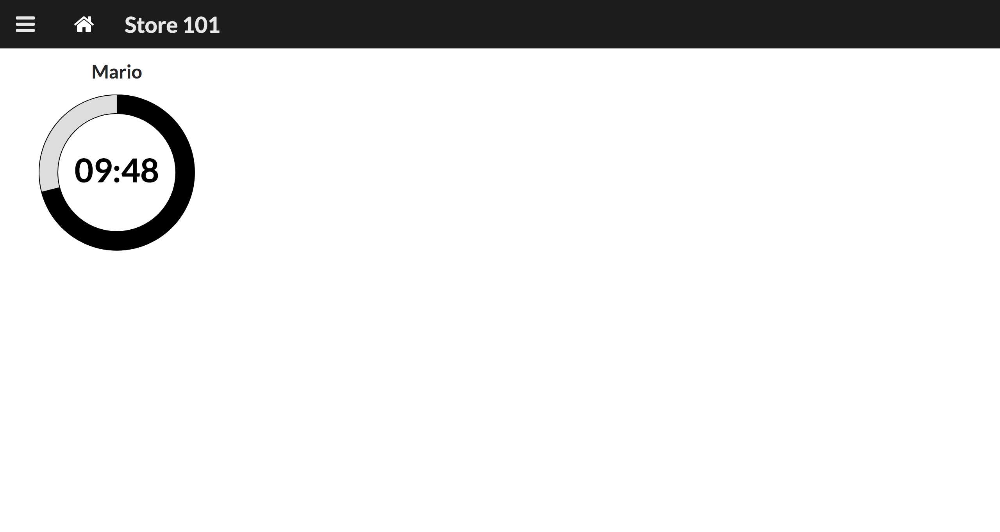
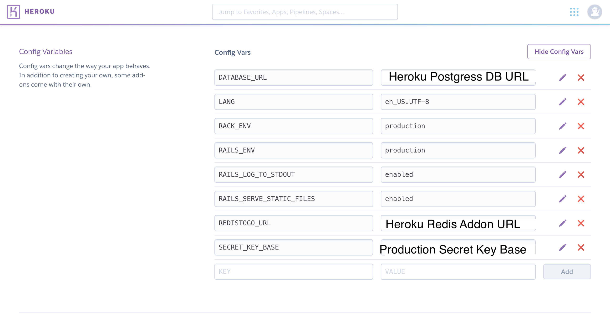
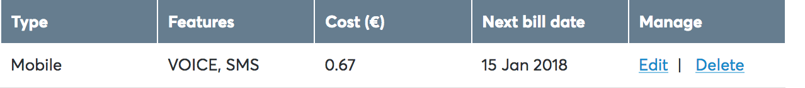
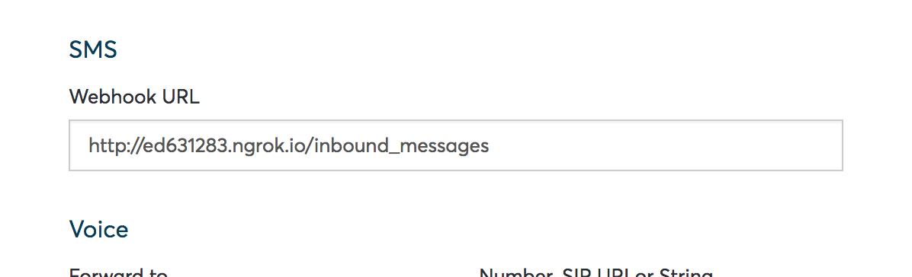

# Driver Timer v3

##### Check out v1 [here](https://github.com/CodingTea17/driver-timer-v1-php "Frankenstein").
##### Check out v2 [here](https://github.com/CodingTea17/driver-timer-v2-mongo-express-node).

## Concept

The idea was to create a simple application to increase delivery efficiency. Drivers were required to call back after every delivery so that shift leads could route the upcoming deliveries and 'insiders' could prepare those orders to be ready as soon as the driver returned. Ideally a driver would return from a delivery and immediately leave on the next. However, that was almost never the case. During rush periods shift leads were unable to mentally keep track of who was returning and phone calls to the store were often not even reported to the shift lead. Drivers would return and the next delivery would not have even been 'slapped out'(rolled out and tossed), delaying an order by 15+ minutes.

#### Goals of the Original Driver Timer (PHP):

* Provide accurate, consistent communication between the drivers and shift lead
* Reduce distractions for driver (e.g. making a phone call while driving back to the store)
* Improve delivery overall times by cutting down out-the-door times

#### Goals of the 2nd Driver Timer (Mongo, Express, Node):

* Rewrite the application to be used at multiple stores.
* Integrate with a cheaper communications API (Nexmo)
* Use a database to store drivers and allow in app driver addition.

#### Goals of the 3rd Driver Timer (Rails, React, Postgres):

* Restructure the project to a RESTful backend API and a modular frontend collection of React components.
* Implement full CRUD functionality for managing drivers.
* Implement Websockets to get live data for each store's drivers.

## Images from Live Implementation for Pizza Guys (VKS Inc.)

The homepage has a map and a list of all the Pizza Guys stores (scraped from the Pizza Guys Website).

The store page displays the store's drivers and their countdowns. There's a link to the homepage and a toggler for the menu.

The menu is toggled from the icon in the top left and shows options to add and delete drivers.

The timer counts down displaying a progress circle and the expected amount of time until the driver will return.

## Setup
  NOTICE: I got carried away with setting up the production environment (it took a lot of trial and error to get Redis up on Heroku and the two separate apps running in unison) and as a result it has more design and features than the development version. I'm working on a solution to merge the two, but until then I've created a production branch which contains the two Heroku deployable applications.

#### Production
  * TBA

  
  

#### Development
  * After successfully cloning the project, `cd driver-timer-v3-Rails-React/backend-driver-timer` and execute `bundle install`. This will install all the required ruby gems inside of the rails project directory.
  * This project requires access to a [Nexmo](https://www.nexmo.com/) SMS phone number. It is not free. However, for the purpose of this project it will only cost ~$1.00 per month because we are only concerned with incoming SMS messages.
  * You need to install ngrok which allows us to open a secure tunnel to localhost so that Nexmo's servers can find our locally running project. Once installed run `ngrok http 3001` (the port which the rails backend will be operating on).   
  * To use the Nexmo phone number you must set the webhook for incoming messages. Start by logging into your Nexmo account.

    
    After logging in navigate to the 'Numbers' page via the 'Numbers' tab in the navbar.

    
    Find (or add) the number you want to use for this project and click 'Edit' on the far right of the numbers table.

    
    Enter your ngrok assigned http address + `/inbound_messages` (how rails is setup to handle new messages) into the Webhook URL input and click 'Update'.

    Note: Unless you pay for ngrok, every time you reboot the ngrok server you will get assigned a new http address and have to go back and set the Webhook URL. It is annoying, but is only necessary for development and keeps costs down.

  * Once the webhook is setup run `rails start` this is a rake task which fires up the rails backend and launches the react frontend.
